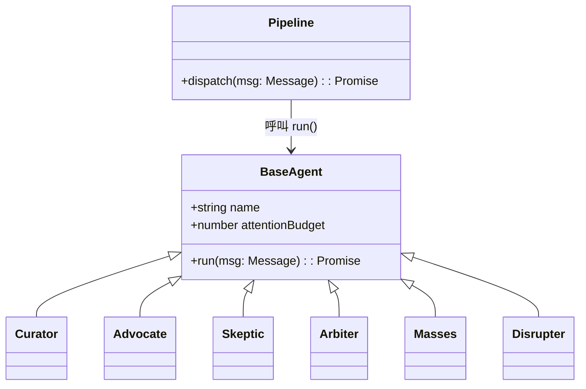
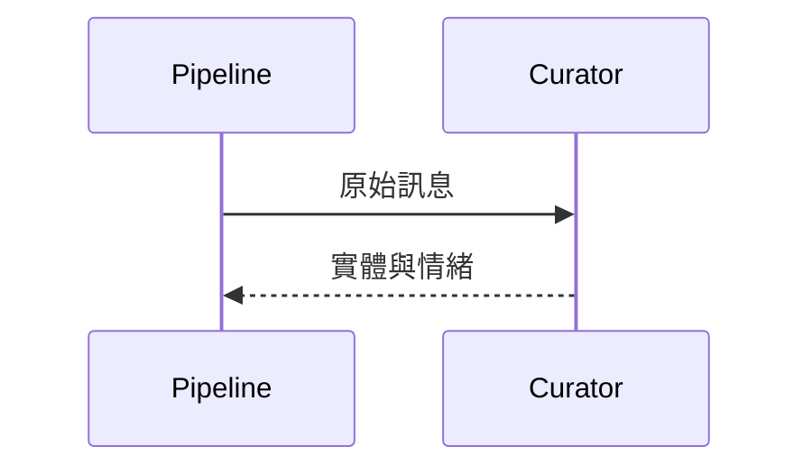
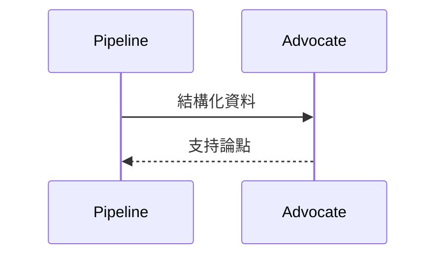
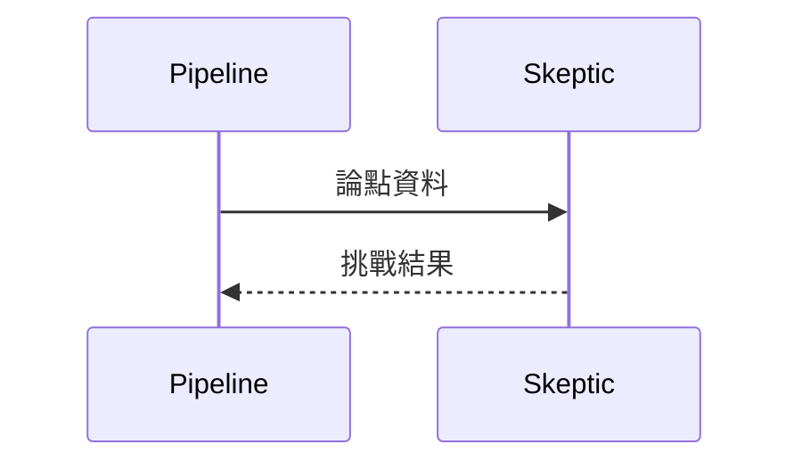
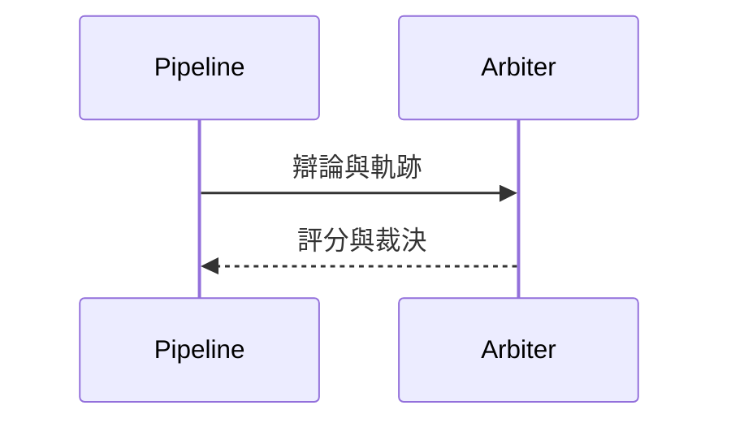
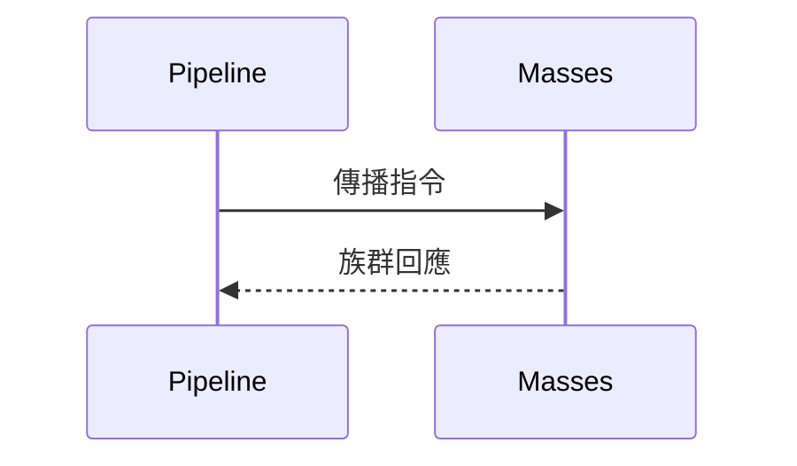
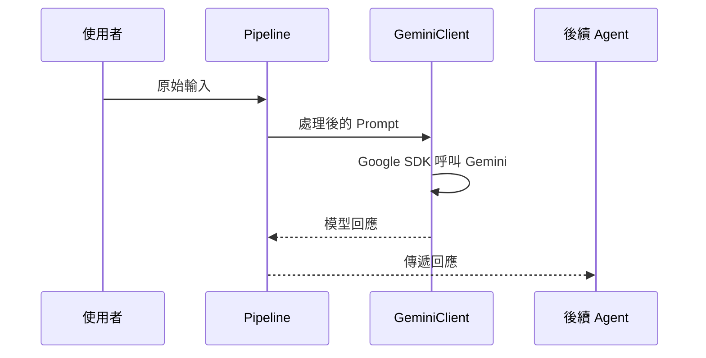
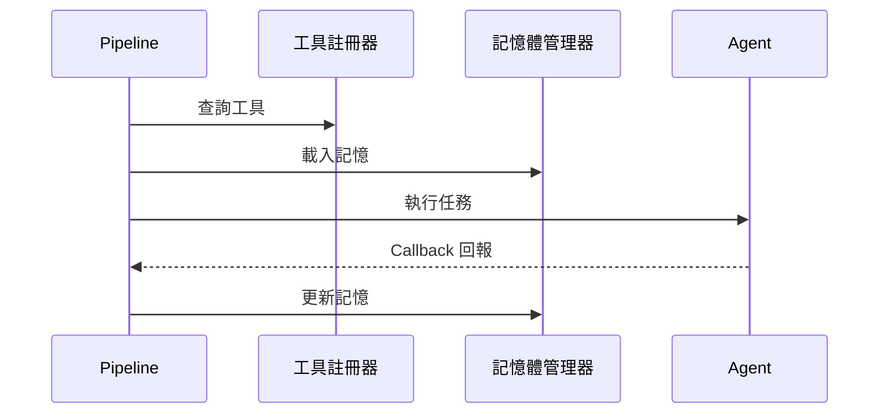
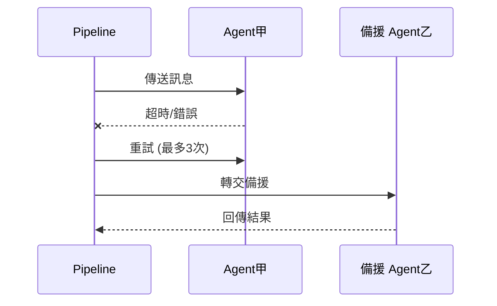

# 系統架構與資料流程

本文檔概述 Agent-Judge 的整體模組設計與資料流向，說明各模組之間的互動與設計考量。

## 模組概觀
- **資料預處理模組**：將外部輸入轉換為結構化資料，供後續 Agent 使用。
- **Gemini 用戶端 (GeminiClient)**：透過 Google SDK 與 Gemini API 互動，產生推論結果。
- **Agent 管線 (Pipeline)**：負責 Agent 與 Agent 之間的 A2A 串聯與訊息傳遞。
- **結果匯整模組**：收集各 Agent 的輸出，生成最終報告。

## BaseAgent 設計
BaseAgent 為所有 Agent 的抽象基底，統一定義欄位與執行介面。

### 共同欄位
- `name`：代理名稱
- `attentionBudget`：注意力資源上限
- `description?`：角色說明（選填）

### run() 介面
每個 Agent 需實作 `run()` 以處理訊息並回傳結果。

Python 範例
```python
from abc import ABC, abstractmethod
from dataclasses import dataclass

@dataclass
class Message:
    content: str  # 訊息內容

@dataclass
class BaseAgent(ABC):
    name: str  # 代理名稱
    attention_budget: int  # 注意力預算

    @abstractmethod
    async def run(self, msg: Message) -> Message:
        """執行後回傳訊息"""
        ...
```

### Pipeline 與 BaseAgent 的互動
Pipeline 依據訊息的 `target` 找到對應的 Agent 實例，呼叫其 `run()` 完成處理，再交給下一個節點。



## Agent 角色與責任
README.md 已詳細定義系統中的核心腳色，下列為其概要：
- **資料預處理 Agent（The Curator）**：萃取實體與情緒，將原始資訊轉為結構化資料。
- **正方 Agent（The Advocate）**：為新聞內容提供佐證與辯護。
- **反方 Agent（The Skeptic）**：質疑新聞內容，搜尋矛盾與錯誤。
- **陪審團 Agent（The Arbiter）**：根據證據與傳播數據進行客觀評分。
- **群眾 Agent（The Masses）**：模擬不同社會群體的資訊傳播行為。
- **謠言製造者 Agent（The Disrupter）**：注入迷惑性訊息以測試系統韌性。

## 各 Agent 模組介面與資料結構範例
以下示範主要 Agent 的輸入、輸出資料型別與呼叫順序，所有範例皆使用 Python 風格並以繁體中文註解。

### The Curator
負責將原始文章轉為實體與情緒資訊。

#### 介面

Python 範例
```python
from dataclasses import dataclass
from typing import List

@dataclass
class CuratorInput:
    raw_text: str  # 原始文章內容

@dataclass
class CuratorOutput:
    entities: List[str]  # 萃取的實體列表
    sentiment: str  # 情緒極性

class Curator:
    async def process(self, input: CuratorInput) -> CuratorOutput:
        """處理輸入並回傳結果"""
        ...
```

#### 資料結構範例
```jsonc
{
  "origin": "User",
  "target": "The Curator",
  "content": "新聞全文", // 原始輸入文字
  "attention_cost": 1,
  "trace_id": "123e4567-e89b-12d3-a456-426614174000"
}
```

#### 呼叫順序圖


### The Advocate
為新聞內容提供佐證與辯護。

#### 介面

Python 範例
```python
from dataclasses import dataclass
from typing import List

@dataclass
class AdvocateInput:
    facts: List[str]  # 已知事實
    article: str  # 文章片段

@dataclass
class AdvocateOutput:
    arguments: List[str]  # 支持論點

class Advocate:
    async def defend(self, input: AdvocateInput) -> AdvocateOutput:
        """生成辯護內容"""
        ...
```

#### 資料結構範例
```jsonc
{
  "origin": "The Curator",
  "target": "The Advocate",
  "content": {
    "facts": ["實體1", "實體2"], // 前置事實
    "article": "文章片段"
  },
  "attention_cost": 2,
  "trace_id": "123e4567-e89b-12d3-a456-426614174000"
}
```

#### 呼叫順序圖


### The Skeptic
負責檢驗矛盾與錯誤。

#### 介面

Python 範例
```python
from dataclasses import dataclass
from typing import List

@dataclass
class SkepticInput:
    claims: List[str]  # 待檢驗的論點

@dataclass
class SkepticOutput:
    challenges: List[str]  # 挑戰與質疑

class Skeptic:
    async def question(self, input: SkepticInput) -> SkepticOutput:
        """提出反駁"""
        ...
```

#### 資料結構範例
```jsonc
{
  "origin": "The Advocate",
  "target": "The Skeptic",
  "content": { "claims": ["論點A"] }, // 需要檢驗的主張
  "attention_cost": 2,
  "trace_id": "123e4567-e89b-12d3-a456-426614174000"
}
```

#### 呼叫順序圖


### The Arbiter
根據辯論與傳播數據進行評分。

#### 介面

Python 範例
```python
from dataclasses import dataclass
from typing import List

@dataclass
class ArbiterInput:
    debates: List[str]  # 辯論內容
    traces: List[str]  # 傳播軌跡

@dataclass
class ArbiterOutput:
    score: float  # 客觀評分
    verdict: str  # 裁決結論

class Arbiter:
    async def judge(self, input: ArbiterInput) -> ArbiterOutput:
        """產生評分與裁決"""
        ...
```

#### 資料結構範例
```jsonc
{
  "origin": "The Skeptic",
  "target": "The Arbiter",
  "content": {
    "debates": ["正反意見"],
    "traces": ["trace_id"]
  },
  "attention_cost": 3,
  "trace_id": "123e4567-e89b-12d3-a456-426614174000"
}
```

#### 呼叫順序圖


### The Masses
模擬群眾的資訊傳播行為。

#### 介面

Python 範例
```python
from dataclasses import dataclass
from typing import Dict, List

@dataclass
class MassesInput:
    message: str  # 需要擴散的訊息
    demographics: List[str]  # 群眾族群

@dataclass
class MassesOutput:
    spread: Dict[str, float]  # 各族群的傳播率

class Masses:
    async def simulate(self, input: MassesInput) -> MassesOutput:
        """模擬傳播"""
        ...
```

#### 資料結構範例
```jsonc
{
  "origin": "The Arbiter",
  "target": "The Masses",
  "content": {
    "message": "評分結果",
    "demographics": ["族群A", "族群B"]
  },
  "attention_cost": 1,
  "trace_id": "123e4567-e89b-12d3-a456-426614174000"
}
```

#### 呼叫順序圖


### The Disrupter
模擬謠言或迷惑性訊息。

#### 介面

Python 範例
```python
from dataclasses import dataclass

@dataclass
class DisrupterInput:
    topic: str  # 目標議題

@dataclass
class DisrupterOutput:
    rumor: str  # 生成的謠言

class Disrupter:
    async def inject(self, input: DisrupterInput) -> DisrupterOutput:
        """注入訊息"""
        ...
```

#### 資料結構範例
```jsonc
{
  "origin": "Pipeline",
  "target": "The Disrupter",
  "content": { "topic": "議題X" }, // 需要操作的主題
  "attention_cost": 1,
  "trace_id": "123e4567-e89b-12d3-a456-426614174000"
}
```

#### 呼叫順序圖


## 使用 Google SDK／Gemini API 的資料流程
1. 外部系統提供輸入給資料預處理模組。
2. Pipeline 將處理後的提示詞送往 GeminiClient。
3. GeminiClient 呼叫 Google SDK，觸發 Gemini API 生成回應。
4. 生成結果回傳至 Pipeline，再傳給下一個 Agent。



### 連線設定、權杖管理與可擴充性
- **環境變數**：透過 `GOOGLE_APPLICATION_CREDENTIALS` 指向服務帳戶金鑰，並以 `GEMINI_API_KEY` 讀取 Gemini 權杖。
- **連線池**：GeminiClient 可配置 HTTP 連線池以重複使用連線，降低延遲。
- **權杖輪替**：Pipeline 可定期輪替 `GEMINI_API_KEY`，並於失效時自動刷新。
- **多專案支援**：透過設定 `projectId`，可動態切換 Google Cloud 專案以分散配額。

Python 範例
```python
import os

client = GeminiClient(
    api_key=os.environ["GEMINI_API_KEY"],  # 從環境變數讀取權杖
    project_id=os.environ.get("GOOGLE_PROJECT_ID")  # 指定雲端專案
)
```

此設計允許日後替換為其他 LLM 供應商，僅需實作相容的 Client 介面並註冊於 Pipeline。

## ADK 整合
ADK（Agent Development Kit）為 Pipeline 提供標準化的工具管理與狀態維護機制，便於擴充各式 Agent 功能。

### Tool Registry
Pipeline 透過 Tool Registry 註冊與查詢可用工具，所有工具以唯一名稱對應實作，執行階段可動態載入或更換。

### 記憶體管理
ADK 提供記憶體管理器以統一處理短期暫存與長期紀錄。Pipeline 在呼叫 Agent 前先讀取相關片段，Agent 完成後再將更新內容寫回，確保上下文連貫。

### Callback 流程
Pipeline 為每個 Agent 註冊回呼函式，ADK 在工具執行或記憶體變動時觸發 Callback，讓 Pipeline 能即時獲知進度、錯誤或中間結果。



## A2A 串聯設計與迴圈控制
1. **訊息標準化**：Pipeline 將每則訊息包裝為含 `origin`、`target`、`content`、`attention_cost` 與 `trace_id` 的結構，確保後續 Agent 能正確解析。
2. **流程圖驅動**：根據預先定義的流程圖，Pipeline 決定下一個 Agent，並將 `trace_id` 寫入傳播軌跡紀錄。
3. **注意力資源機制**：每個 Agent 擁有有限的 `attention_budget`，Pipeline 每次傳遞訊息時會扣除相對應的 `attention_cost`，當資源耗盡，該 Agent 將被暫停，避免無限循環。
4. **多維度判斷**：陪審團 Agent 不僅接收辯論內容，還會從傳播軌跡資料庫擷取 `trace_id` 與關聯度，以建立更全面的評分依據。
5. **仲裁終止條件**：若所有參與 Agent 的注意力資源耗盡、達到最大回合數，或陪審團給出最終決議，Pipeline 即終止串聯並輸出結果。
6. **迴圈偵測**：Pipeline 會計算訊息內容的雜湊值，若相同訊息在相同路徑重複出現，將觸發警示並交由陪審團判斷是否提前結束流程。

## A2A 可能的錯誤情境與容錯策略
- **Agent 超時**：若代理在指定時間內無回應，Pipeline 會重試三次，仍失敗則交由備援 Agent 處理。
- **API 配額耗盡**：GeminiClient 回報配額錯誤時，Pipeline 啟動排程延遲並通知監控系統。
- **資料格式錯誤**：訊息驗證失敗時，Pipeline 會回傳錯誤並中止該路徑，避免污染後續 Agent。
- **重複訊息**：偵測到相同 `trace_id` 與內容時，觸發循環警示並交由陪審團決定是否終止。



## 擴充點、潛在問題與例外處理
- **擴充點**：
  - 透過 Plugin 介面註冊自訂 Agent，建立新型態的分析或傳播節點。
  - GeminiClient 支援多模型選擇與動態配置，可根據場景切換模型或雲端供應商。
- **潛在問題與規劃**：
  - *注意力資源設定不當*：若某些 Agent 的預算過高，可能導致迴圈延長；需定期監控並調整。
  - *傳播軌跡過大*：長期記錄可能造成儲存壓力，可採分段存檔或建立索引。
  - *多 Agent 競爭資源*：同時併發呼叫 API 可能超出配額，建議在 Pipeline 層實作佇列與節流。
- **例外處理**：
  - API 呼叫失敗時，GeminiClient 回傳錯誤碼與重試建議，Pipeline 可採取退避機制。
  - Agent 超時或崩潰時，Pipeline 會記錄錯誤並透過替代 Agent 或預設策略繼續流程。
