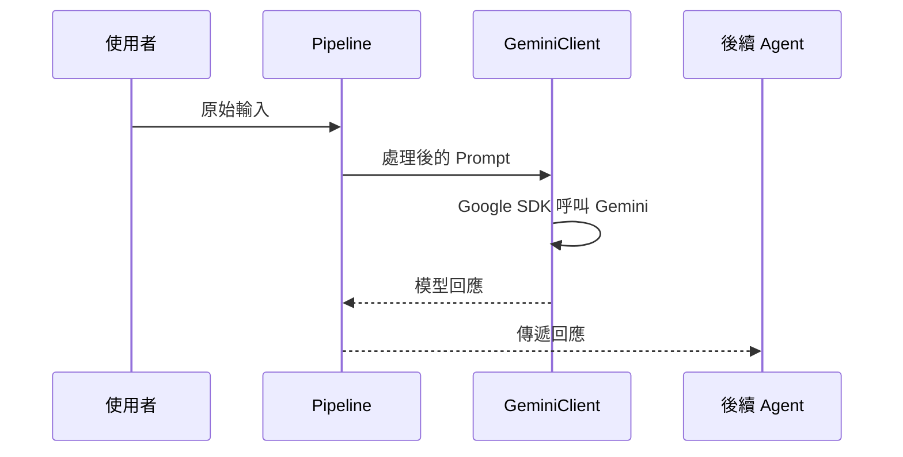

# 系統架構與資料流程

本文檔概述 Agent-Judge 的整體模組設計與資料流向，說明各模組之間的互動與設計考量。

## 模組概觀
- **資料預處理模組**：將外部輸入轉換為結構化資料，供後續 Agent 使用。
- **Gemini 用戶端 (GeminiClient)**：透過 Google SDK 與 Gemini API 互動，產生推論結果。
- **Agent 管線 (Pipeline)**：負責 Agent 與 Agent 之間的 A2A 串聯與訊息傳遞。
- **結果匯整模組**：收集各 Agent 的輸出，生成最終報告。

## Agent 角色與責任
README.md 已詳細定義系統中的核心腳色，下列為其概要：
- **資料預處理 Agent（The Curator）**：萃取實體與情緒，將原始資訊轉為結構化資料。
- **正方 Agent（The Advocate）**：為新聞內容提供佐證與辯護。
- **反方 Agent（The Skeptic）**：質疑新聞內容，搜尋矛盾與錯誤。
- **陪審團 Agent（The Arbiter）**：根據證據與傳播數據進行客觀評分。
- **群眾 Agent（The Masses）**：模擬不同社會群體的資訊傳播行為。
- **謠言製造者 Agent（The Disrupter）**：注入迷惑性訊息以測試系統韌性。

## 使用 Google SDK／Gemini API 的資料流程
1. 外部系統提供輸入給資料預處理模組。
2. Pipeline 將處理後的提示詞送往 GeminiClient。
3. GeminiClient 呼叫 Google SDK，觸發 Gemini API 生成回應。
4. 生成結果回傳至 Pipeline，再傳給下一個 Agent。

## A2A 串聯設計與迴圈控制
1. **訊息標準化**：Pipeline 將每則訊息包裝為含 `origin`、`target`、`content`、`attention_cost` 與 `trace_id` 的結構，確保後續 Agent 能正確解析。
2. **流程圖驅動**：根據預先定義的流程圖，Pipeline 決定下一個 Agent，並將 `trace_id` 寫入傳播軌跡紀錄。
3. **注意力資源機制**：每個 Agent 擁有有限的 `attention_budget`，Pipeline 每次傳遞訊息時會扣除相對應的 `attention_cost`，當資源耗盡，該 Agent 將被暫停，避免無限循環。
4. **多維度判斷**：陪審團 Agent 不僅接收辯論內容，還會從傳播軌跡資料庫擷取 `trace_id` 與關聯度，以建立更全面的評分依據。
5. **仲裁終止條件**：若所有參與 Agent 的注意力資源耗盡、達到最大回合數，或陪審團給出最終決議，Pipeline 即終止串聯並輸出結果。
6. **迴圈偵測**：Pipeline 會計算訊息內容的雜湊值，若相同訊息在相同路徑重複出現，將觸發警示並交由陪審團判斷是否提前結束流程。

## 擴充點、潛在問題與例外處理
- **擴充點**：
  - 透過 Plugin 介面註冊自訂 Agent，建立新型態的分析或傳播節點。
  - GeminiClient 支援多模型選擇與動態配置，可根據場景切換模型或雲端供應商。
- **潛在問題與規劃**：
  - *注意力資源設定不當*：若某些 Agent 的預算過高，可能導致迴圈延長；需定期監控並調整。
  - *傳播軌跡過大*：長期記錄可能造成儲存壓力，可採分段存檔或建立索引。
  - *多 Agent 競爭資源*：同時併發呼叫 API 可能超出配額，建議在 Pipeline 層實作佇列與節流。
- **例外處理**：
  - API 呼叫失敗時，GeminiClient 回傳錯誤碼與重試建議，Pipeline 可採取退避機制。
  - Agent 超時或崩潰時，Pipeline 會記錄錯誤並透過替代 Agent 或預設策略繼續流程。
