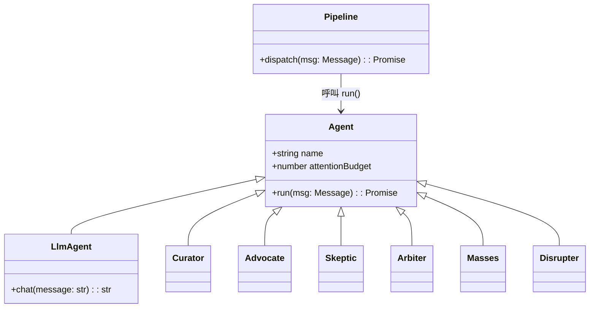

# 系統架構與資料流程

本文檔概述 Agent-Judge 的整體模組設計與資料流向，說明各模組之間的互動與設計考量。

## 模組概觀
- **資料預處理模組**：將外部輸入轉換為結構化資料，供後續 Agent 使用。
- **Gemini 用戶端 (GeminiClient)**：透過 Google SDK 與 Gemini API 互動，產生推論結果。
- **Agent 管線 (Pipeline)**：負責 ADK 代理之間的 A2A 串聯與訊息傳遞。
- **結果匯整模組**：收集各 Agent 的輸出，生成最終報告。

## ADK Agent 與共用機制
所有代理直接繼承 [ADK](https://github.com/google-deepmind/google-agents) 提供的 `Agent` 或 `LlmAgent` 類別，無須自訂 `BaseAgent`。若多個代理需要共用行為，可利用 ADK 的事件與工具機制協調，例如在代理中註冊工具並透過事件回呼取得執行紀錄。

Python 範例
```python
from google.adk.agents.llm_agent import LlmAgent
from google.adk.tools import google_search

class NewsBot(LlmAgent):
    """示範整合工具與事件的 LLM 代理"""

    def __init__(self, **kwargs):
        super().__init__(tools=[google_search], **kwargs)
```

### Pipeline 與 ADK Agent 的互動
Pipeline 依據訊息的 `target` 找到對應的代理實例，呼叫其 `run()` 完成處理，再交給下一個節點。所有代理皆符合 ADK 的介面規範，可共享事件與工具。



## Agent 角色與責任
README.md 已詳細定義系統中的核心腳色，下列為其概要：
- **資料預處理 Agent（The Curator）**：整理多筆文字資料，去重並輸出摘要。
- **正方 Agent（The Advocate）**：為提案生成正面論述。
- **反方 Agent（The Skeptic）**：質疑主張，搜尋矛盾與錯誤。
- **陪審團 Agent（The Arbiter）**：根據多方意見進行多數決評分。
- **群眾 Agent（The Masses）**：模擬不同社會群體的回應行為。
- **破壞者 Agent（The Disrupter）**：挑戰現狀以測試系統韌性。

## 各 Agent 模組介面與資料結構範例
以下示範主要 Agent 的輸入、輸出資料型別與呼叫順序，所有範例皆使用 Python 風格並以繁體中文註解。

### The Curator
負責將多筆文字資料去重並條列整理，提供清晰摘要。

#### 介面

Python 範例
```python
from google.adk import Agent


class Curator(Agent):
    """策展者代理，去重並整理文字資訊"""

    def run(self, materials: list[str]) -> list[str]:
        unique_items: list[str] = []
        for item in materials:
            cleaned = item.strip()
            if cleaned and cleaned not in unique_items:
                unique_items.append(cleaned)
        return unique_items
```

#### 資料結構範例
```jsonc
{
  "origin": "User",
  "target": "The Curator",
  "content": ["資訊1", "資訊2"], // 待整理的文字列表
  "attention_cost": 1,
  "trace_id": "123e4567-e89b-12d3-a456-426614174000"
}
```

#### 呼叫順序圖


### The Advocate
為提案生成正面論述，說服受眾接受該提案。

#### 介面

Python 範例
```python
from google.adk import Agent


class Advocate(Agent):
    """倡議者代理，產生支持陳述"""

    def run(self, proposal: str) -> str:
        return f"我們應該推動{proposal}，它將帶來顯著的正面影響。"
```

#### 資料結構範例
```jsonc
{
  "origin": "Pipeline",
  "target": "The Advocate",
  "content": "提案內容", // 需要倡議的提案
  "attention_cost": 1,
  "trace_id": "123e4567-e89b-12d3-a456-426614174000"
}
```

#### 呼叫順序圖


### The Skeptic
針對主張提出質疑，檢驗論點的完整性與可靠度。

#### 介面

Python 範例
```python
from google.adk import Agent


class Skeptic(Agent):
    """懷疑者代理，提出關鍵質疑"""

    def run(self, claim: str) -> str:
        return f"我們有足夠證據支持『{claim}』嗎？"
```

#### 資料結構範例
```jsonc
{
  "origin": "The Advocate",
  "target": "The Skeptic",
  "content": "論點A", // 需要檢驗的主張
  "attention_cost": 2,
  "trace_id": "123e4567-e89b-12d3-a456-426614174000"
}
```

#### 呼叫順序圖


### The Arbiter
接收多方意見並計算多數決結果，輸出最終裁決。

#### 介面

Python 範例
```python
from google.adk import Agent


class Arbiter(Agent):
    """仲裁者代理，計算多數決"""

    def run(self, opinions: list[str]) -> str:
        if not opinions:
            return "無可裁決意見"
        decision = max(set(opinions), key=opinions.count)
        return f"裁決結果：{decision}"
```

#### 資料結構範例
```jsonc
{
  "origin": "The Skeptic",
  "target": "The Arbiter",
  "content": ["贊成", "反對"], // 各方意見
  "attention_cost": 3,
  "trace_id": "123e4567-e89b-12d3-a456-426614174000"
}
```

#### 呼叫順序圖


### The Masses
模擬多數群體對議題的回應，產生具代表性的集體觀點。

#### 介面

Python 範例
```python
from google.adk import Agent


class Masses(Agent):
    """群眾代理，產生模擬回應"""

    def run(self, question: str, size: int = 3) -> list[str]:
        return [f"群眾{i + 1}：對『{question}』的看法" for i in range(size)]
```

#### 資料結構範例
```jsonc
{
  "origin": "The Arbiter",
  "target": "The Masses",
  "content": { "question": "議題描述", "size": 3 }, // 要詢問的問題與模擬人數
  "attention_cost": 1,
  "trace_id": "123e4567-e89b-12d3-a456-426614174000"
}
```

#### 呼叫順序圖


### The Disrupter
針對既定假設提出反向觀點，促進創新與反思。

#### 介面

Python 範例
```python
from google.adk import Agent


class Disrupter(Agent):
    """破壞者代理，挑戰現狀"""

    def run(self, status_quo: str) -> str:
        return f"如果我們不再遵循『{status_quo}』，會產生什麼新可能？"
```

#### 資料結構範例
```jsonc
{
  "origin": "Pipeline",
  "target": "The Disrupter",
  "content": "現狀描述", // 需要挑戰的現狀
  "attention_cost": 1,
  "trace_id": "123e4567-e89b-12d3-a456-426614174000"
}
```

#### 呼叫順序圖


## 使用 Google SDK／Gemini API 的資料流程
1. 外部系統提供輸入給資料預處理模組。
2. Pipeline 將處理後的提示詞送往 GeminiClient。
3. GeminiClient 呼叫 Google SDK，觸發 Gemini API 生成回應。
4. 生成結果回傳至 Pipeline，再傳給下一個 Agent。


### 連線設定、權杖管理與可擴充性
- **環境變數**：透過 `GOOGLE_APPLICATION_CREDENTIALS` 指向服務帳戶金鑰，並以 `GEMINI_API_KEY` 讀取 Gemini 權杖。
- **連線池**：GeminiClient 可配置 HTTP 連線池以重複使用連線，降低延遲。
- **權杖輪替**：Pipeline 可定期輪替 `GEMINI_API_KEY`，並於失效時自動刷新。
- **多專案支援**：透過設定 `projectId`，可動態切換 Google Cloud 專案以分散配額。

Python 範例
```python
import os

client = GeminiClient(
    api_key=os.environ["GEMINI_API_KEY"],  # 從環境變數讀取權杖
    project_id=os.environ.get("GOOGLE_PROJECT_ID")  # 指定雲端專案
)
```

此設計允許日後替換為其他 LLM 供應商，僅需實作相容的 Client 介面並註冊於 Pipeline。

## ADK 整合
ADK（Agent Development Kit）為 Pipeline 提供標準化的事件與工具管理機制，可在多個 Agent 間共用行為並擴充功能。

### Tool Registry
Pipeline 透過 Tool Registry 註冊與查詢可用工具，所有工具以唯一名稱對應實作，執行階段可動態載入或更換。

### 記憶體管理
ADK 提供記憶體管理器以統一處理短期暫存與長期紀錄。Pipeline 在呼叫 Agent 前先讀取相關片段，Agent 完成後再將更新內容寫回，確保上下文連貫。

### Callback 流程
Pipeline 為每個 Agent 註冊回呼函式，ADK 在工具執行或記憶體變動時觸發 Callback，讓 Pipeline 能即時獲知進度、錯誤或中間結果。


## A2A 串聯設計與迴圈控制
1. **訊息標準化**：Pipeline 將每則訊息包裝為含 `origin`、`target`、`content`、`attention_cost` 與 `trace_id` 的結構，確保後續 Agent 能正確解析。
2. **流程圖驅動**：根據預先定義的流程圖，Pipeline 決定下一個 Agent，並將 `trace_id` 寫入傳播軌跡紀錄。
3. **注意力資源機制**：每個 Agent 擁有有限的 `attention_budget`，Pipeline 每次傳遞訊息時會扣除相對應的 `attention_cost`，當資源耗盡，該 Agent 將被暫停，避免無限循環。
4. **多維度判斷**：陪審團 Agent 不僅接收辯論內容，還會從傳播軌跡資料庫擷取 `trace_id` 與關聯度，以建立更全面的評分依據。
5. **仲裁終止條件**：若所有參與 Agent 的注意力資源耗盡、達到最大回合數，或陪審團給出最終決議，Pipeline 即終止串聯並輸出結果。
6. **迴圈偵測**：Pipeline 會計算訊息內容的雜湊值，若相同訊息在相同路徑重複出現，將觸發警示並交由陪審團判斷是否提前結束流程。

## A2A 可能的錯誤情境與容錯策略
- **Agent 超時**：若代理在指定時間內無回應，Pipeline 會重試三次，仍失敗則交由備援 Agent 處理。
- **API 配額耗盡**：GeminiClient 回報配額錯誤時，Pipeline 啟動排程延遲並通知監控系統。
- **資料格式錯誤**：訊息驗證失敗時，Pipeline 會回傳錯誤並中止該路徑，避免污染後續 Agent。
- **重複訊息**：偵測到相同 `trace_id` 與內容時，觸發循環警示並交由陪審團決定是否終止。


## 擴充點、潛在問題與例外處理
- **擴充點**：
  - 透過 Plugin 介面註冊自訂 Agent，建立新型態的分析或傳播節點。
  - GeminiClient 支援多模型選擇與動態配置，可根據場景切換模型或雲端供應商。
- **潛在問題與規劃**：
  - *注意力資源設定不當*：若某些 Agent 的預算過高，可能導致迴圈延長；需定期監控並調整。
  - *傳播軌跡過大*：長期記錄可能造成儲存壓力，可採分段存檔或建立索引。
  - *多 Agent 競爭資源*：同時併發呼叫 API 可能超出配額，建議在 Pipeline 層實作佇列與節流。
- **例外處理**：
  - API 呼叫失敗時，GeminiClient 回傳錯誤碼與重試建議，Pipeline 可採取退避機制。
  - Agent 超時或崩潰時，Pipeline 會記錄錯誤並透過替代 Agent 或預設策略繼續流程。
