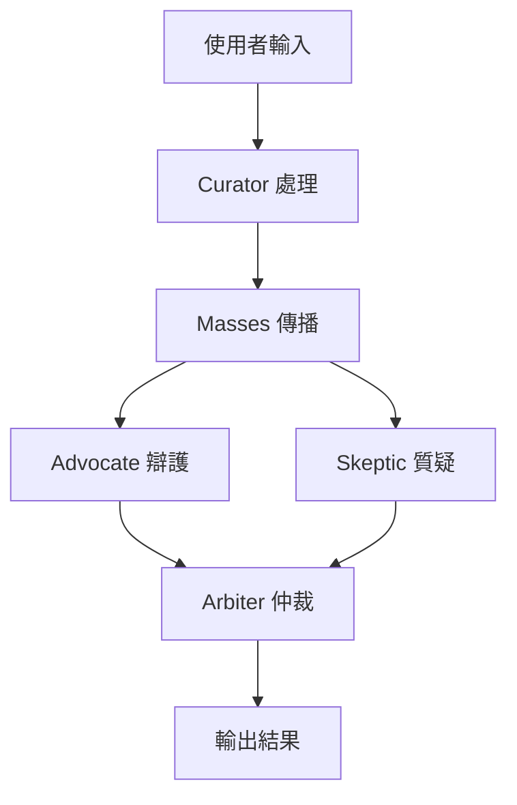

# Agent-Judge
> 「讓資訊回歸真實的多智能體法庭」

Agent-Judge 以多 Agent 協作為核心，致力於在資訊爆炸時代提供可擴充的假新聞辨識平台。
這個專案結合 NLP、社群模擬與資料可視化，協助研究者、媒體與一般使用者快速驗證資訊真偽。
**關鍵特色**：自動化證據交叉比對、情緒傳播追蹤、可插拔 Agent 架構。
**實際應用場景**：選舉期間的訊息核查、企業危機公關、教育訓練與媒體素養課程。

## 核心特色
- 多 Agent 分工協作，模擬真實社會角色
- 支援情緒與傳播路徑分析，捕捉隱性影響力
- 模組化設計，易於擴充與整合外部服務

## 示意流程圖


## 未來展望
- 建立即時資料串流，應對快速變化的社群動態
- 整合多語言模型，擴展至跨文化資訊環境
- 引入可視化儀表板，提升分析結果的理解度

## Agent 角色與核心邏輯
### 資料預處理 Agent（The Curator）
- 將非結構化新聞轉為結構化資料
- 文本分析：NER、情緒分析、主題標籤
- 多媒體處理：圖片/影片比對與連結來源追溯

### 正反方 Agent（The Advocate & The Skeptic）
- Advocate：提供佐證與解釋
- Skeptic：尋找矛盾並核查來源

### 陪審團 Agent（The Arbiter）
- 以證據可信度、邏輯一致性、傳播軌跡、情感強度等維度評分並仲裁

### 群眾 Agent（The Masses）
- 模擬不同社會群體的資訊傳播與情緒感染

### 謠言製造者 Agent（The Disrupter）
- 在關鍵時刻注入虛假資訊以測試系統韌性

## 系統運作流程
1. 使用者輸入新聞，Curator 產生結構化資料  
2. 新聞於 Masses 網路傳播並記錄情緒  
3. Advocate 與 Skeptic 進行辯論，Disrupter 視情況插入  
4. Arbiter 統合所有數據計算可信度分數  

## 最終輸出
- 總體可信度分數
- 主要爭議點
- 傳播力與情緒影響
- 佐證資料鏈

## 迴圈與 A2A 機制
- 每個 Agent 有限的注意力資源，避免無限迴圈
- Arbiter 結合辯論與傳播數據做出終止判斷

## ADK 與本專案的整合
Google 的 Agent Development Kit（ADK）提供工具整合、跨模型支援、回呼與記憶機制等多代理功能，與本專案的可插拔 Agent 架構相輔相成，可協助快速擴充與管理多 Agent 流程。

## 快速上手
1. 取得程式碼並建立虛擬環境：
   ```bash
   git clone https://github.com/your-account/Agent-Judge.git
   cd Agent-Judge
   python -m venv .venv
   source .venv/bin/activate
   ```
2. 安裝依賴（需先安裝 Google SDK）：
   ```bash
   pip install google-cloud-sdk
   pip install google-adk
   ```
   - `google-adk`：Google Agent Development Kit（非 Android Development Kit），提供工具整合、跨模型支援、回呼與記憶機制等多代理功能，與本專案的可插拔 Agent 架構相輔相成
   - [官方教學](https://google.github.io/adk-docs/get-started/)：快速了解 ADK 的使用方式
3. 執行測試：
   ```bash
   python -m pytest
   ```
