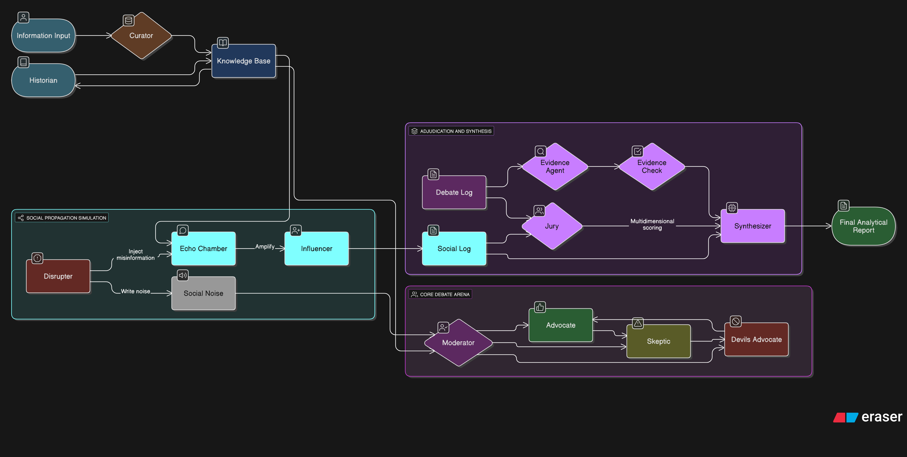

<p align="center">
  
</p>

# Agent-Judge

本專案為多代理辯論系統，目標在於對假新聞進行可觀察、可審計與可復現的分析，透過多角色協作產出結構化報告。

## 安裝
```bash
pip install -r requirements.txt
```

## 執行
```bash
python -m root_agent.agent
```

## 系統架構

Curator → Historian → Moderator 的流程自資料整理、歷史脈絡建構到辯論主持，逐步完成查核與分析。

## 測試與 CI/CD
```bash
pytest
```
目前 CI/CD 狀態：已配置 GitHub Actions（`ci.yml`, `cd.yml`）進行持續整合與部署。
