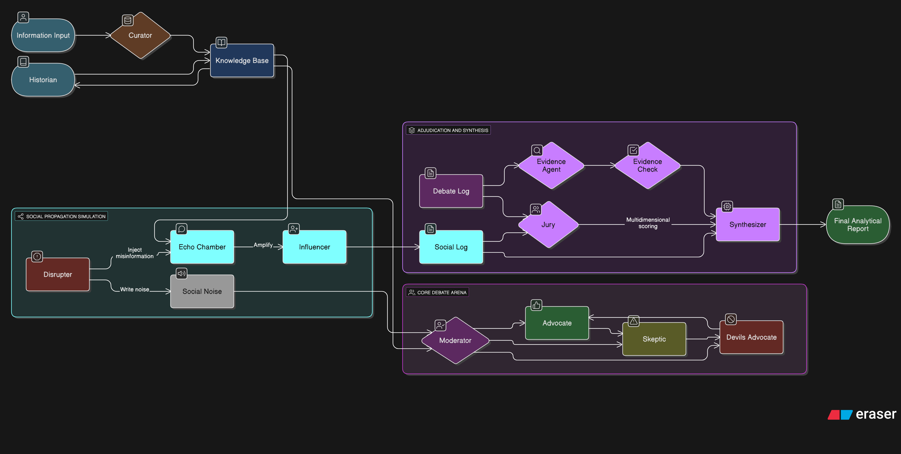
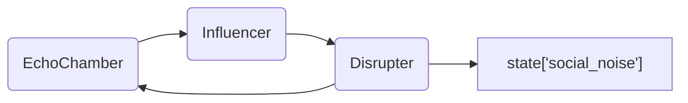
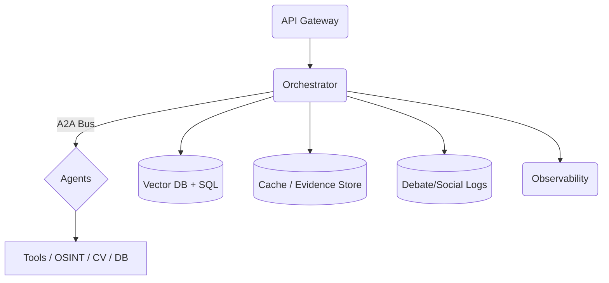

# ARCHITECTURE.md — 假新聞分析多代理辯論系統（依論文觀點重寫）

> 目標：打造**可被觀察、可審計、可復現**的多代理辯論系統，透過「辯論—社會傳播—裁決—整合」四階段流程，以結構化證據鏈輸出**最終分析報告**（真偽結論、爭點整理、可信度分數、傳播風險、歷史脈絡與建議）。

---

## 1. 設計原則（Design Principles）
- **Evidence-first**：所有論點需附證據鏈（Source→Claim→Warrant），可回溯出處。
- **Debate-as-Coordination**：以回合制辯論協定（Debate Protocol）協調多代理角色，避免單一模型偏誤。
- **Social Dynamics**：模擬同溫層、意見領袖與情緒感染，評估傳播風險。
- **Adjudication & Synthesis**：陪審團多維評分＋知識整合者輸出可讀報告。
- **Pragmatic Orchestration**：以「A2A（Agent-to-Agent）」訊息規範與 ADK 代理類型映射，確保實作落地。

---

## 2. 角色與職責（Agents & Roles）

### 2.1 資料基礎層（Foundation Layer）
- **The Curator｜資料預處理**：將原始新聞/貼文整理成結構化卡片（實體、情緒、時間、地點、來源、可信度預估），建立**知識小圖（Graphlet）**。
- **The Historian｜歷史脈絡**：生成時間軸（實體→事件），做「舊聞新炒」與模式比對（常見宣傳敘事模板），回寫至知識庫。

### 2.2 對話思辨層（Discourse Layer）
- **The Moderator｜主持人**：掌控節奏、分配回合、聚焦議題、標注邏輯謬誤（僅標記、不中裁）。
- **The Advocate｜正方**：提出支持主張的證據與論證鍊。
- **The Skeptic｜反方**：對主張進行反證、來源挑戰、脈絡檢核。
- **The Devil’s Advocate｜極端質疑者**：以最強反對劇本施壓（陰謀、滑坡、極端假設），挖掘隱含前提，測試韌性。

### 2.3 社會動態層（Social Dynamics Layer）
- **The Echo Chamber｜同溫層網路**：多子群（立場/價值/信任來源）結構，模擬意見極化與重複強化效應。
- **The Influencer｜意見領袖**：高連結度節點，放大或扭轉社群風向。
- **The Disrupter｜謠言製造者**：依社群情緒注入最易擴散的干擾訊息（文字/影像），用於壓力測試。

### 2.4 裁決與整合層（Synthesis & Judgment Layer）
- **The Evidence Checker｜證據查核者**：串接 Google Search Tool 逐句查證主張並輸出證據鍊。
- **The Jury｜陪審團**：依「證據品質、邏輯嚴謹、論證韌性、社會影響」四維打分。
- **The Synthesizer｜知識整合者**：彙整辯論與傳播數據，產出報告與行動建議。

---

## 3. 系統總覽（Architecture Overview）


---

## 4. 辯論協定（Debate Protocol）
**回合制**：`R` 輪，每輪含三步：
1) 主持人下達子議題與目標（對齊最小可驗證主張，MVC）。
2) 正反方依序發言，均需附**證據鏈**與**不確定性聲明**。
3) 極端質疑者提出高壓測試（如：對來源真偽、樣本偏差、選擇性呈現），主持人標注謬誤並收斂爭點。

**終止條件**：
- Δ爭點 < 門檻、Δ可信度 < 門檻、或達到最大輪數；
- 新證據收益（資訊增益）趨近 0；
- 反覆攻防無新增至少一條可驗證主張。

**證據鏈（Evidence Chain）**：
- `source`: 來源（URL/檔案/圖像）＋時間戳；
- `claim`: 可驗證的命題；
- `warrant`: 連結來源與命題的理由；
- `method`: 驗證方法（反向搜索/影像取證/數據重算）；
- `risk`: 混淆因素與限制；
- `confidence`: 0–1。

---

## 5. 社會傳播模型（Echo Chamber Model）
- **偏好向量** `p_g ∈ R^k`：群組 g 的立場/價值偏好。
- **信任矩陣** `T[u,v]`：使用者/節點間的信任權重（含來源類型權重）。
- **擴散函數** `σ(m, p_g, e)`：訊息 m 在情緒 e（怒/恐/喜）下的採納率；重複曝光具強化項 `γ`。
- **風險指標**：
  - `PolarizationIndex`（群際距離/群內方差）、
  - `ViralityScore`（基本傳染數 R₀ 類比）、
  - `ManipulationRisk`（易受操弄度）。

### Social Noise 噪音注入

EchoChamber 先呈現各社群群組的回應，Influencer 依此放大或扭轉訊息，Disrupter 再根據風向注入最易擴散的噪音。該噪音會即時寫入 `state["social_noise"]`，供裁決層評估傳播風險與後續策略。

---

## 6. 裁決與整合（Adjudication & Synthesis）
**Jury 四維打分（0–100）**：
- 證據品質（0–30）：權威性、時效性、相關性。
- 邏輯嚴謹（0–30）：一致性、謬誤率、還原度。
- 論證韌性（0–20）：承受極端測試能力。
- 社會影響（0–20）：傳播風險、情緒煽動性。

**總體可信度**：`Score = α*Evidence + β*Logic + γ*Robustness + δ*Social(↓)`，其中 `Social` 代表**風險折減**，δ 可為負權（依治理策略）。

**Synthesizer 報告欄位**：
- 一頁總覽（結論、可信度、要點）
- 爭點地圖（2–3 個核心爭論點，各方要旨）
- 傳播風險（社群/情緒視覺化）
- 歷史脈絡（關鍵節點與軌跡）
- 證據索引（可點擊回溯）
- 建議（澄清文、媒體應對、教育指引）

---

## 7. 可觀測性與審計（Observability & Audit）
- **Debate Log**：每輪發言（角色、主張、證據鏈、謬誤標示、信心）。
- **Social Log**：擴散路徑、情緒曲線、採納率、KOL 節點。
- **Evidence Registry**：來源指紋（URL、hash、截圖、OCR 文本）與驗證結果。
- **Repro Pack**：重跑所需 YAML（版本、溫度、工具、門檻、權重）。

---

## 8. 與 Google ADK 的映射（Mapping to ADK）
- **Curator, Historian** → `SequentialAgent`（NER/OSINT/DB 的工具鏈）。
- **Debate Arena（M, P, S, Dv）** → `LoopAgent` 管理回合，內部角色以 `LlmAgent` 定義行為（System Prompt 分化）。
- **Echo Chamber / Social** → `ParallelAgent` 產生多群回應，迭代由外部控制器或 `LoopAgent` 管理。
- **Jury + Synthesizer** → `WorkflowAgent`（先評分 Tool，再交由 `LlmAgent` 生成報告）。
- **A2A 訊息結構**：`{role, goal, inputs, evidence[], constraints, expected_output}`。

---

## 9. 介面規格（Schemas）
```ts
// Evidence Chain
interface Evidence {
  id: string; source: string; fetched_at: string; type: 'text'|'image'|'video'|'table';
  claim: string; warrant: string; method: string; risk: string; confidence: number;
  hash?: string; locator?: string; annotations?: string[];
}

// Debate Turn
interface Turn { round: number; role: 'Moderator'|'Advocate'|'Skeptic'|'DevilsAdvocate';
  topic: string; statement: string; evidences: Evidence[]; fallacies?: string[]; confidence: number; }

// Social Metrics per tick
interface SocialTick { tick: number; group: string; adoption: number; emotion: 'anger'|'fear'|'joy'|'neutral'; influencer_boost?: number; }

// Jury Score
interface JuryScore { evidence: number; logic: number; robustness: number; social: number; total: number; notes?: string; }
```

---

## 10. 評測與指標（Evaluation）
- **Truthfulness**：對照權威資料庫/查核報告的命題準確率。
- **Consistency**：跨輪前後一致度、矛盾檢測率。
- **Robustness**：面對對抗提示（註入式、越權、隱喻）的穩定性。
- **Social Risk**：極化指數、煽動性分數、KOL 依賴度。
- **Latency/Cost**：回合耗時、工具調用成本、快取命中率。

---

## 11. 提示模板（Prompt Templates）
**Moderator（system）**：
> 你是辯論主持人。根據「上一輪爭點」產生 1–2 個**可驗證子命題**，分配回合並限制每位辯論者的輸出結構：`{claim, evidence[], reasoning, uncertainty}`，標註可能的邏輯謬誤，但不做裁決。

**Advocate / Skeptic（system）**：
> 你是{role}。針對 `claim` 提供最強證據鏈與推理，並主動列出限制與對手最可能的反駁。

**Devil’s Advocate（system）**：
> 你負責壓力測試此論點，以極端但**可被駁斥的**方式提出挑戰，目的在找出隱含假設與脆弱點。

**Jury（tool）**：
> 依四維打分並輸出理由段落與加權總分。

**Synthesizer（system）**：
> 匯整辯論與社會數據，產出「一頁總覽＋爭點地圖＋風險視覺化＋建議」。

---

## 12. 執行流程（Pseudo Code）
```python
for round in range(MAX_ROUNDS):
    subclaims = Moderator.propose_subclaims(context)
    for claim in subclaims:
        pro = Advocate.argue(claim, kb, tools)
        con = Skeptic.rebut(claim, kb, tools)
        stress = DevilsAdvocate.attack(claim, kb, patterns)
        Moderator.annotate_fallacies([pro, con, stress])
        DebateLog.append(round, claim, [pro, con, stress])
    if stop_condition(DebateLog):
        break

social_noise = Disrupter.inject(EchoChamber)
state["social_noise"] = social_noise
social_log = SocialLog.simulate(EchoChamber, Influencer, social_noise)
evidence = EvidenceAgent.verify(DebateLog)
checked = EvidenceCheck.run(evidence)
score = Jury.score(DebateLog, social_log, checked)
report = Synthesizer.write(DebateLog, social_log, checked, score)
```

---

## 13. 部署與元件（Deployment Topology）


- **Cache 策略**：證據哈希去重、圖像反搜結果快取、RAG 段落索引。
- **安全**：提示注入防禦、工具輸入白名單、來源完整記錄。
- **重現性**：參數與權重寫入 Repro Pack。

---

## 14. 風險與對策（Risks & Mitigations）
- 對抗訊息注入 → 角色提示隔離、字串過濾、策略投票。
- 誤導性圖像 → 反向搜尋＋Exif＋陰影/邊緣一致性檢測。
- 社會煽動 → 風險折減納入總分、提出速速澄清建議。

---

## 15. 未來工作（Future Work）
- 對話博弈學習（self-play）讓辯論者持續增強。
- 以人為迴路（HITL）將查核員評注併入訓練資料。
- 多模態辯論（表格、地圖、影片逐幀）與跨語系一致性。

---

> 本文件提供**可實作**的端到端設計：從 Agent 行為、協定、資料結構、評測，到 ADK 對應與部署。你可以直接據此拆解成模組與 issue，逐步落地。

