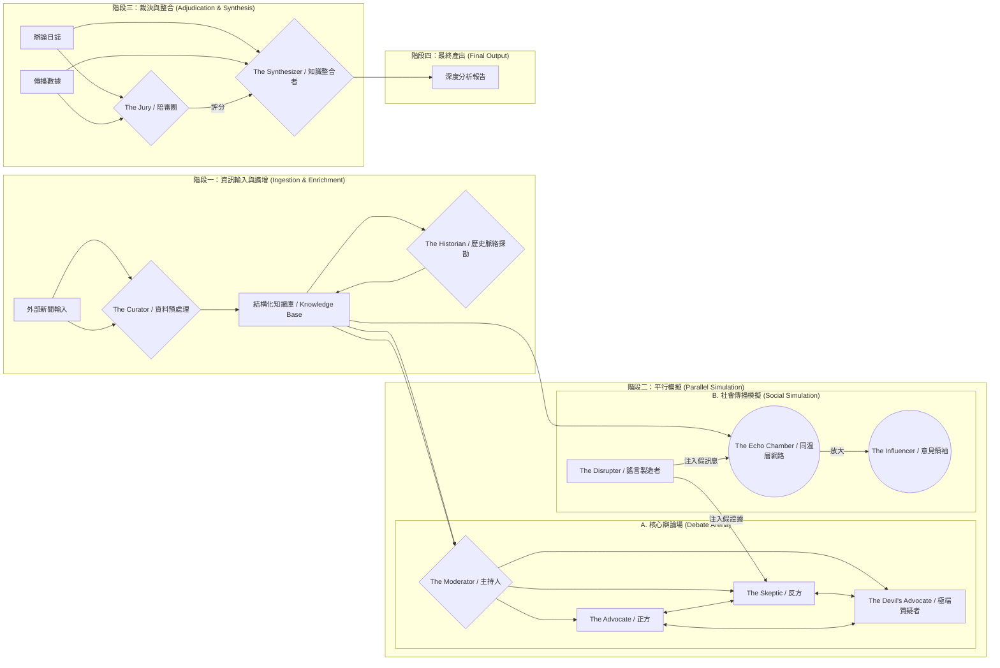

### **進階多代理人辯論與分析架構 (Advanced Multi-Agent Debate & Analysis Architecture)**

---

#### **I. 核心理念：打造一個「話語生態模擬器」**

傳統的辯論模型聚焦於正反兩方的對決，但現實世界遠比這複雜。本架構引入了三大創新理念：

1.  **角色光譜化 (Role Spectrum)**：不僅有正方和反方，我們引入了更多元的「灰色」角色，如專注於歷史脈絡的「歷史學家」、負責辯論秩序的「主持人」，以及專門為了壓力測試而存在的「極端質疑者」。
2.  **動態社會模擬 (Dynamic Social Simulation)**：將「群眾」角色從單純的傳播節點，升級為具有內在偏見與互動模式的「同溫層網路」，更真實地模擬情緒感染與意見極化。
3.  **整合式報告 (Synthesized Reporting)**：最終產出不僅是一個「可信度分數」，而是一份由「知識整合者」產出的深度報告，綜合所有辯論觀點、傳播軌跡與潛在爭議，提供完整的決策視野。

---

#### **II. 架構總覽圖 (Architecture Overview)**

---

#### **III. Agent 角色深度設計 (Detailed Agent Role Design)**

##### **第一層：資料基礎層 (Foundation Layer)**

1.  **The Curator (資料預處理 Agent)**
    * **職責**：與您文件中定義的相同，負責將非結構化輸入轉化為結構化資料。
    * **創新輸出**：不僅是提取實體和情緒，它會生成一個初始的 **「知識圖譜節點 (Knowledge Graphlet)」**，包含關鍵人物、事件、地點之間的關係，以及引用的來源權威性評級。

2.  **The Historian (歷史脈絡探勘者 Agent) - [新角色]**
    * **職責**：作為一個獨立的調查員，專門挖掘與新聞主題相關的歷史背景。
    * **核心邏輯**：
        * **時間軸追溯**：搜尋新聞中關鍵實體過去的相關事件，建立時間軸。
        * **模式識別**：分析這則新聞的敘事手法是否與歷史上的某些宣傳或假新聞模式相似。
        * **舊聞新炒檢查**：驗證新聞中的圖片、影片或數據是否為過時資訊的重新包裝。
    * **互動方式**：將其發現的「歷史背景報告」注入到「結構化知識庫」中，供所有辯論角色參考。

##### **第二層：對話思辨層 (Discourse Layer)**

3.  **The Moderator (辯論主持人 Agent) - [新角色]**
    * **職責**：確保辯論的品質與秩序，是流程的管理者而非內容的裁判。
    * **核心邏輯**：
        * **流程控制**：設定發言順序、時間限制，確保各方有平等的發言機會。
        * **議題聚焦**：防止辯論偏離主題，當對話發散時，會主動拉回核心爭議點。
        * **邏輯謬誤警察**：能初步識別並標記出辯論中的邏輯謬誤（如人身攻擊、稻草人論證），但不直接干預，僅作為陪審團評分的參考。

4.  **The Advocate (正方) & The Skeptic (反方)**
    * **職責**：維持您文件中定義的核心功能，分別進行佐證與質疑。
    * **能力升級**：它們能夠讀取並利用 **Historian** 提供的歷史脈絡來強化或反駁論點。例如，正方可以說「這符合過去一貫的政策方向」，反方則可以質疑「這又是歷史上某某事件的翻版，意圖誤導」。

5.  **The Devil's Advocate (極端質疑者 Agent) - [新角色]**
    * **職責**：不是單純的反方，它的任務是 **「建構最強大的反對劇本」**，即使這個劇本看起來很荒謬。
    * **核心邏輯**：
        * **壓力測試**：它會故意採用陰謀論、極端解讀或滑坡謬誤來攻擊正方的論點，目的是測試正方論證的穩固性。
        * **挖掘隱藏假設**：透過極端提問，揭示正方論點背後未曾言明的假設。
    * **價值**：如果正方的論點連極端質疑者的攻擊都能應對，那麼其可信度將大大增強。

##### **第三層：社會動態層 (Social Dynamics Layer)**

6.  **The Echo Chamber (同溫層網路) - [群眾 Agent 升級]**
    * **職責**：模擬資訊在不同社會群體中的傳播與極化過程。
    * **核心邏輯**：
        * **多社群建模**：由多個具有預設偏見（如政治立場、價值觀、信任的訊息來源）的子 Agent 群組成。
        * **信任與強化機制**：來自社群內部或信任來源的訊息更容易被接受和轉發。重複接觸相似觀點會強化其偏見。
        * **情緒感染**：訊息所附帶的情緒（如憤怒、恐懼）會在同溫層內快速傳播並被放大。

7.  **The Influencer (意見領袖 Agent) - [新角色]**
    * **職責**：在同溫層網路中扮演關鍵節點，模擬KOL的影響力。
    * **核心邏輯**：擁有比普通節點更多的連接，其轉發或發表的評論會被賦予更高的權重，能更快地引爆或扭轉社群輿論。

8.  **The Disrupter (謠言製造者 Agent)**
    * **職責**：與您文件中定義的相同，在關鍵時刻注入高度迷惑性的假訊息。
    * **策略升級**：它會監控 **Echo Chamber** 的輿論風向，並製造最能迎合特定同溫層偏見的謠言，以達到最大化的傳播效果。

##### **第四層：裁決與整合層 (Synthesis & Judgment Layer)**

9.  **The Jury (陪審團 Agent)**
    * **職責**：獨立、客觀地為辯論過程打分。
    * **評分維度升級**：
        * **證據品質 (0-30分)**：來源權威性、時效性、相關性。
        * **邏輯嚴謹性 (0-30分)**：論證是否一致，是否存在邏輯謬誤（參考 Moderator 的標記）。
        * **論證韌性 (0-20分)**：論點在面對 **Skeptic** 和 **Devil's Advocate** 壓力測試下的穩固程度。
        * **社會影響力 (0-20分)**：結合 **Echo Chamber** 的數據，評估訊息的潛在煽動性與傳播模式。

10. **The Synthesizer (知識整合者 Agent) - [新角色]**
    * **職責**：這是整個架構的最終出口，負責生成一份全面、中立且富有洞察的報告。
    * **核心邏輯**：
        * **多視角整合**：它會閱讀完整的辯論日誌（包含正、反、極端質疑者的所有觀點）和社會傳播數據。
        * **爭議點識別**：自動識別並總結辯論中最核心的幾個爭議焦點。
        * **生成最終報告**：產出一份結構化的報告，而不僅僅是一個分數。

---

#### **IV. 系統運作流程 (System Workflow)**

1.  **階段一：輸入與擴增 (Ingestion & Enrichment)**
    * 使用者輸入新聞，**Curator** 進行結構化處理，生成知識圖譜節點。
    * **Historian** 被觸發，對知識庫中的實體進行深度歷史挖掘，並將結果補充回知識庫。

2.  **階段二：平行模擬 (Parallel Simulation)**
    * **核心辯論場** 和 **社會傳播模擬** *同時* 啟動。
    * 在辯論場中，**Moderator** 開始主持，引導 **Advocate**, **Skeptic**, **Devil's Advocate** 根據知識庫中的資訊進行多回合辯論。
    * 同時，新聞被注入 **Echo Chamber**，開始模擬其傳播、情緒感染和意見領袖的放大效應。
    * **Disrupter** 在此期間持續監控，並在預設的時機（如辯論僵持、或某個同溫層情緒高漲時）注入干擾。

3.  **階段三：裁決與整合 (Adjudication & Synthesis)**
    * 辯論達到終止條件（如達到最大回合數、或無新論點產生）。
    * **Jury** 根據完整的辯論日誌和社會傳播數據，按照升級後的評分維度進行打分。
    * **Synthesizer** 接收所有日誌和 **Jury** 的評分結果。

4.  **階段四：報告生成 (Report Generation)**
    * **Synthesizer** 整合所有資訊，生成最終的深度分析報告。報告格式如下：
        * **總體可信度評估**：包含 **Jury** 的最終分數和一個綜合性的結論（如：高度可信、爭議極大、證據不足、極可能為誤導訊息）。
        * **核心爭議點分析**：列出 2-3 個最主要的爭論焦點，並簡述各方（包括 Devil's Advocate）的觀點。
        * **傳播風險評估**：視覺化圖表展示該訊息在哪類群體中傳播最快、引發了何種情緒、以及潛在的社會極化風險。
        * **歷史脈絡與背景**：附上 **Historian** 的關鍵發現。
        * **證據與論證鏈**：提供一個可追溯的完整辯論記錄連結。

---

#### **V. 技術實現對應 (Mapping to Google ADK)**

* **Curator & Historian**：可實現為一個 `SequentialAgent`，按順序調用一系列 `Tool`（如NER API、網路搜尋、資料庫查詢）。
* **Moderator & 辯論核心**：可使用一個 `LoopAgent` 來管理多回合辯論。`Moderator` 的邏輯控制循環的進行與終止，而內部的 `Advocate`, `Skeptic`, `Devil's Advocate` 都是 `LlmAgent`，透過不同的系統提示（System Prompt）來定義其角色和行為。
* **Echo Chamber & Social Simulation**：使用 `ParallelAgent` 來初始化所有子 Agent 的第一波反應。後續的多輪傳播可由一個外部的循環控制器或 `LoopAgent` 管理。每個子 Agent 可以是輕量級的 `Custom Agent`，其行為由程式碼邏輯定義，而非昂貴的 LLM 呼叫。
* **Jury & Synthesizer**：可設計為一個頂層的 `WorkflowAgent`。先調用一個 `Tool`（評分函數）來完成 **Jury** 的計分任務，然後將所有結果（日誌、分數）傳遞給一個 `LlmAgent`（即 **Synthesizer**），由它來生成最終的自然語言報告。

這個架構不僅回答了「這則新聞是真是假」，更深入地探討了「為什麼這則新聞會被相信/不被相信」、「它會對社會造成什麼影響」以及「我們應該從哪些角度去全面理解它」。這是一個更具備現實洞察力和決策輔助價值的新一代辯論分析框架。
